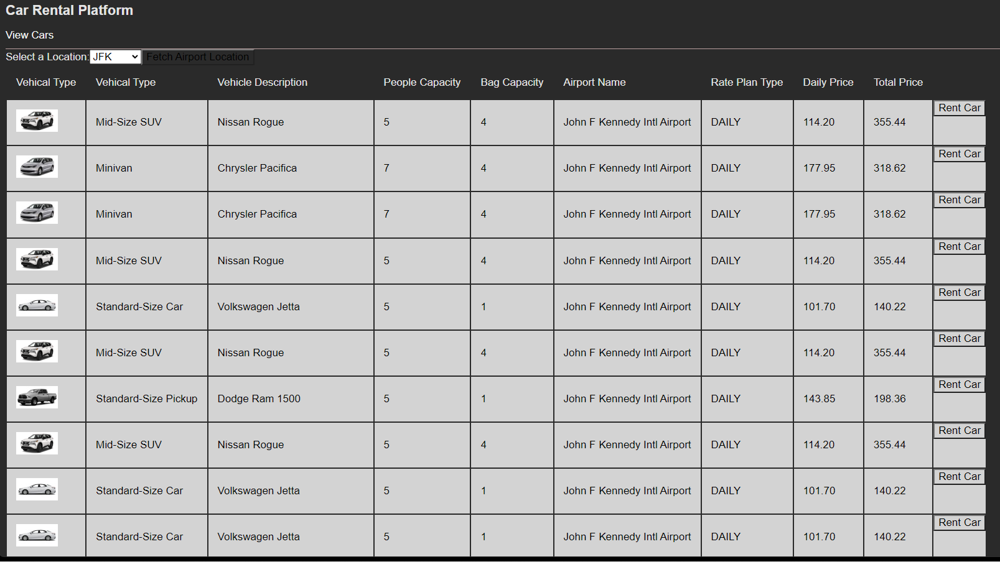

# Welcome to Rent'n'Go

Rent'n'Go is a car rental platform and car price API aggregator. 

 

### Features
* Dashboard that displays cars available for rental within the specified range
* Filter for airports
* Tracks car rental history

### Built With

- React
- React Router
- Node
- Express
- supertest
- MongoDB
- React Testing Library
- Jest

### Authors

- **Abeer Faizan** - [@abeer-f](https://github.com/abeer-f)

#### License

This project is licensed under the MIT License